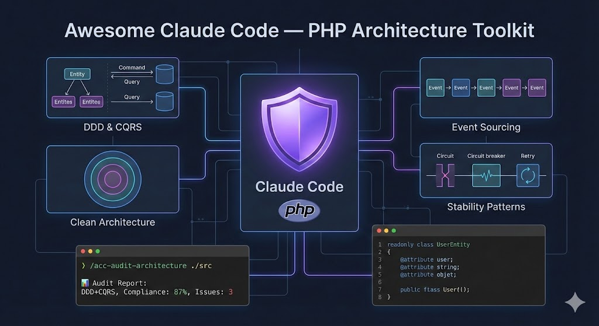

# Awesome Claude Code — PHP Architecture Toolkit

[](https://packagist.org/packages/dykyi-roman/awesome-claude-code)
[](https://packagist.org/packages/dykyi-roman/awesome-claude-code)
[](https://php.net)
[](https://claude.ai/code)
[](https://en.wikipedia.org/wiki/Domain-driven_design)
[](https://martinfowler.com/bliki/CQRS.html)
[](https://packagist.org/packages/dykyi-roman/awesome-claude-code)
[](https://github.com/dykyi-roman/awesome-claude-code)
[](https://github.com/dykyi-roman/awesome-claude-code)

> **The most comprehensive Claude Code extension for PHP developers.**
> Audit, Generate & Document: DDD, CQRS, Event Sourcing, Clean/Hexagonal Architecture, Design Patterns, PSR, Tests ...



## Table of Contents

- [Features](#features)
- [Demo](#demo)
- [Requirements](#requirements)
- [Quick Start](#quick-start)
- [Use Cases](#use-cases)
- [Overview](#overview)
- [Commands](#commands)
- [Agents](#agents)
- [Skills](#skills)
- [Component Flow](#component-flow)
- [Supported Patterns](#supported-patterns)
- [Hooks](#hooks)
- [MCP](#mcp)
- [FAQ](#faq)
- [Contributing](#contributing)
- [License](#license)

## Features

- **127 Skills** — DDD, CQRS, Clean Architecture, Stability Patterns, PSR implementations, Testing, Documentation, Code Review, Security, Performance, SOLID/GRASP audits
- **21 Hooks** — DDD/Architecture guards, security checks, code quality, PSR compliance, git workflow protection
- **MCP Support** — Database (PostgreSQL/MySQL), GitHub, Docker integration
- **Architecture Audit** — Automated compliance checking for 10+ patterns
- **Zero Config** — Auto-installs to `.claude/` directory via Composer
- **Knowledge Bases** — Deep expertise in DDD, CQRS, Hexagonal, EDA, Stability patterns

## Demo

### Architecture Audit

```bash
/acc-audit-architecture ./src
```

```
📊 Architecture Audit Report
├── Pattern: DDD + CQRS detected
├── Compliance: 87%
├── Issues: 3 warnings
│   ├── Domain layer has infrastructure dependency (UserRepository.php:45)
│   ├── Missing aggregate root for Order context
│   └── Query handler modifies state (GetUserHandler.php:23)
└── Recommendations: 5 suggestions
    ├── Extract OrderAggregate from Order entity
    ├── Move repository implementation to Infrastructure
    └── ... (3 more)
```

### Code Generation

```bash
/acc-write-claude-component
> What would you like to create? Entity
> Entity name? User
> Properties? id:UserId, email:Email, name:string
```

Generates:
- `src/Domain/User/User.php` — Entity with validation
- `src/Domain/User/UserRepositoryInterface.php` — Repository interface
- `tests/Unit/Domain/User/UserTest.php` — Unit tests

### PSR Compliance Check

```bash
/acc-audit-psr ./src
```

```
📋 PSR Compliance Report
├── PSR-1: ✅ Passed
├── PSR-4: ✅ Passed
├── PSR-12: ⚠️ 2 warnings
│   ├── Line too long (UserService.php:89)
│   └── Missing blank line after namespace
└── PSR Interfaces: 3 implementations detected
```

## Why Use This?

| Without | With Awesome Claude Code |
|---------|--------------------------|
| Manual boilerplate code | One command generates complete component |
| Architecture drift | Automated compliance audits |
| Inconsistent patterns | Standardized DDD/CQRS templates |
| Hours of setup | Instant productivity |
| Learning curve | Built-in knowledge bases |

## Requirements

- **PHP 8.5+** — for generated code (strict typing, readonly classes)
- **Composer 2.0+** — for package installation
- **Claude Code CLI** — [Installation guide](https://docs.anthropic.com/en/docs/claude-code)

## Quick Start

```bash
composer require dykyi-roman/awesome-claude-code
```

Then in Claude Code:

```
/acc-audit-architecture ./src
```

Components are **automatically copied** to your project's `.claude/` directory:
- `commands/` — slash commands
- `agents/` — subagents
- `skills/` — knowledge bases and generators

Existing files are not overwritten.

## Use Cases

| Scenario | Command | Result |
|----------|---------|--------|
| Audit existing architecture | `/acc-audit-architecture ./src` | Full compliance report with recommendations |
| Create DDD entity | `/acc-write-claude-component` → Entity | Entity + Repository interface + Unit tests |
| Generate Value Object | `/acc-write-claude-component` → Value Object | Immutable VO with validation + tests |
| Check PSR compliance | `/acc-audit-psr ./src` | Coding standards report (PSR-1, 4, 12) |
| Generate documentation | `/acc-write-documentation` | README + ARCHITECTURE.md + diagrams |
| Audit documentation quality | `/acc-audit-documentation ./docs` | Completeness and accuracy report |
| Create stability pattern | `/acc-write-claude-component` → Circuit Breaker | Pattern implementation + tests |
| DDD-specific audit | `/acc-audit-ddd ./src` | Domain model analysis + suggestions |

## Overview

| Component | Count | Description |
|-----------|-------|-------------|
| Commands | 11 | Slash commands for audits, generation, commits, code review |
| Agents | 29 | Specialized subagents for complex tasks |
| Skills | 127 | Knowledge bases, code generators, templates, reviewers |

## Documentation

- [Commands](docs/commands.md) — 11 slash commands
- [Agents](docs/agents.md) — 29 subagents
- [Skills](docs/skills.md) — 127 skills (knowledge + generators + templates + reviewers)
- [Hooks](docs/hooks.md) — 10 ready-to-use hooks for PHP/DDD
- [MCP](docs/mcp.md) — Model Context Protocol servers
- [Component Flow](docs/component-flow.md) — dependency graph and workflows
- [Quick Reference](docs/quick-reference.md) — paths, formats, best practices

## Commands

All commands support **meta-instructions** via `--` separator for additional context:

```bash
/acc-audit-ddd ./src -- focus on aggregate boundaries
/acc-write-test src/Order.php -- only unit tests
/acc-commit v2.5.0 -- mention breaking changes
```

| Command                       | Arguments                     | Description                                       |
|-------------------------------|-------------------------------|---------------------------------------------------|
| `/acc-commit`                 | `[tag] [-- instructions]`     | Auto-generate commit message and push             |
| `/acc-write-claude-component` | `[type] [-- instructions]`    | Create commands, agents, skills, hooks            |
| `/acc-audit-claude-components`| `[-- instructions]`           | Audit `.claude/` folder quality                   |
| `/acc-audit-architecture`     | `<path> [-- instructions]`    | Multi-pattern architecture audit                  |
| `/acc-audit-ddd`              | `<path> [-- instructions]`    | DDD compliance analysis                           |
| `/acc-audit-psr`              | `<path> [-- instructions]`    | PSR compliance audit                              |
| `/acc-write-documentation`    | `<path> [-- instructions]`    | Generate documentation                            |
| `/acc-audit-documentation`    | `<path> [-- instructions]`    | Audit documentation quality                       |
| `/acc-write-test`             | `<path> [-- instructions]`    | Generate tests for PHP code                       |
| `/acc-audit-test`             | `<path> [-- instructions]`    | Audit test quality and coverage                   |
| `/acc-code-review`            | `[branch] [level] [-- task]`  | Multi-level code review with task matching        |

## Agents

### Coordinators (delegate to specialized agents)

| Agent                        | Description                                                                               |
|------------------------------|-------------------------------------------------------------------------------------------|
| `acc-architecture-auditor`   | Architecture audit coordinator (orchestrates structural, behavioral, integration auditors)|
| `acc-pattern-auditor`        | Design patterns audit coordinator (orchestrates stability, behavioral, creational, integration auditors) |
| `acc-pattern-generator`      | Design patterns generation coordinator (orchestrates stability, behavioral, creational, integration generators) |
| `acc-code-review-coordinator`| Code review coordinator (orchestrates bug, security, performance, readability, testability reviewers) |

### Auditors

| Agent                        | Description                                                                               |
|------------------------------|-------------------------------------------------------------------------------------------|
| `acc-structural-auditor`     | Structural patterns auditor (DDD, Clean, Hexagonal, Layered, SOLID, GRASP) — 11 skills    |
| `acc-behavioral-auditor`     | Behavioral patterns auditor (CQRS, Event Sourcing, EDA, Strategy, State, etc.) — 13 skills|
| `acc-integration-auditor`    | Integration patterns auditor (Outbox, Saga, ADR) — 12 skills                              |
| `acc-stability-auditor`      | Stability patterns auditor (Circuit Breaker, Retry, Rate Limiter, Bulkhead) — 5 skills    |
| `acc-creational-auditor`     | Creational patterns auditor (Builder, Object Pool, Factory) — 3 skills                    |
| `acc-ddd-auditor`            | Specialized DDD compliance auditor — 4 knowledge skills                                   |
| `acc-psr-auditor`            | PSR compliance auditor (PSR-1/12, PSR-4, PSR interfaces)                                  |
| `acc-documentation-auditor`  | Documentation quality auditor (completeness, accuracy, clarity)                           |
| `acc-test-auditor`           | Test quality auditor (coverage, smells, naming, isolation)                                |
| `acc-bug-hunter`             | Bug detection specialist (logic errors, null pointers, race conditions, resource leaks) — 9 skills       |
| `acc-security-reviewer`      | Security review specialist (input validation, auth, CSRF, crypto, sensitive data) — 9 skills             |
| `acc-performance-reviewer`   | Performance review specialist (N+1 queries, memory, caching, complexity) — 8 skills                      |
| `acc-readability-reviewer`   | Readability review specialist (naming, style, method/class length, nesting) — 9 skills                   |
| `acc-testability-reviewer`   | Testability review specialist (DI, pure functions, side effects, test quality) — 7 skills                |

### Generators

| Agent                        | Description                                                                               |
|------------------------------|-------------------------------------------------------------------------------------------|
| `acc-architecture-generator` | Generates architecture components based on detected patterns                              |
| `acc-ddd-generator`          | Creates DDD components (Entity, ValueObject, Aggregate, Repository, etc.)                 |
| `acc-stability-generator`    | Generates stability patterns (Circuit Breaker, Retry, Rate Limiter, Bulkhead) — 5 skills  |
| `acc-behavioral-generator`   | Generates behavioral patterns (Strategy, State, Chain, Decorator, Null Object) — 5 skills |
| `acc-creational-generator`   | Generates creational patterns (Builder, Object Pool, Factory) — 3 skills                  |
| `acc-integration-generator`  | Generates integration patterns (Outbox, Saga, Action, Responder) — 7 skills               |
| `acc-psr-generator`          | Generates PSR-compliant PHP components                                                    |
| `acc-documentation-writer`   | Technical documentation writer (README, architecture, API docs)                           |
| `acc-diagram-designer`       | Diagram designer for Mermaid, C4 models, sequence diagrams                                |
| `acc-test-generator`         | Test generator for DDD/CQRS projects (unit, integration, builders)                        |

### Experts

| Agent                        | Description                                                                               |
|------------------------------|-------------------------------------------------------------------------------------------|
| `acc-claude-code-expert`     | Expert in Claude Code architecture and extensions                                         |

## Skills

### Skills by Category

| Category | Count | Examples |
|----------|-------|----------|
| Knowledge | 21 | DDD, CQRS, Clean Architecture, SOLID, GRASP, PSR |
| Analyzer | 9 | SOLID violations, code smells, coupling/cohesion, bounded contexts |
| DDD Generators | 10 | Entity, ValueObject, Aggregate, Repository |
| CQRS Generators | 4 | Command, Query, UseCase, ReadModel |
| Stability Patterns | 4 | CircuitBreaker, Retry, RateLimiter, Bulkhead |
| Integration Patterns | 2 | Saga, Outbox |
| Behavioral Patterns | 6 | Strategy, State, Decorator, Chain, NullObject, Policy |
| Creational Patterns | 4 | Builder, ObjectPool, DIContainer, Mediator |
| ADR Patterns | 2 | Action, Responder |
| PSR Implementations | 11 | PSR-3, 6, 7, 11, 13, 14, 15, 16, 17, 18, 20 |
| Documentation Templates | 9 | README, Architecture, ADR, API, Mermaid |
| Bug Detection | 9 | Logic errors, null pointers, race conditions, resource leaks |
| Security Review | 9 | Input validation, authentication, CSRF, crypto, SQL injection |
| Performance Review | 8 | N+1 queries, memory issues, caching, complexity |
| Readability Review | 9 | Naming, code style, method/class length, nesting depth |
| Testability Review | 5 | DI, pure functions, side effects, test quality |

### Knowledge Skills

| Skill                              | Description                                             |
|------------------------------------|---------------------------------------------------------|
| `acc-claude-code-knowledge`        | Knowledge base for Claude Code formats and patterns     |
| `acc-ddd-knowledge`                | DDD patterns, antipatterns, PHP guidelines              |
| `acc-cqrs-knowledge`               | CQRS patterns, command/query separation                 |
| `acc-clean-arch-knowledge`         | Clean Architecture, dependency rules                    |
| `acc-hexagonal-knowledge`          | Hexagonal Architecture, Ports & Adapters patterns       |
| `acc-layer-arch-knowledge`         | Layered Architecture, DTO patterns                      |
| `acc-event-sourcing-knowledge`     | Event Sourcing, projections, snapshots                  |
| `acc-eda-knowledge`                | Event-Driven Architecture, messaging, sagas             |
| `acc-saga-pattern-knowledge`       | Saga pattern, orchestration, compensation               |
| `acc-outbox-pattern-knowledge`     | Transactional Outbox, reliable messaging                |
| `acc-stability-patterns-knowledge` | Circuit Breaker, Retry, Rate Limiter, Bulkhead          |
| `acc-solid-knowledge`              | SOLID principles (SRP, OCP, LSP, ISP, DIP)              |
| `acc-grasp-knowledge`              | GRASP patterns (9 responsibility assignment principles) |
| `acc-adr-knowledge`                | Action-Domain-Responder pattern (MVC alternative)       |
| `acc-psr-coding-style-knowledge`   | PSR-1/PSR-12 coding standards                           |
| `acc-psr-autoloading-knowledge`    | PSR-4 autoloading standard                              |
| `acc-psr-overview-knowledge`       | All PSR standards overview                              |
| `acc-documentation-knowledge`      | Documentation types, audiences, best practices          |
| `acc-diagram-knowledge`            | Mermaid syntax, C4 model, diagram best practices        |
| `acc-documentation-qa-knowledge`   | Documentation quality checklists, audit criteria        |

### Generator Skills

#### DDD Components

| Skill                              | Description                                |
|------------------------------------|--------------------------------------------|
| `acc-create-value-object`          | Generates DDD Value Objects with tests     |
| `acc-create-entity`                | Generates DDD Entities with tests          |
| `acc-create-aggregate`             | Generates DDD Aggregates with tests        |
| `acc-create-domain-event`          | Generates Domain Events with tests         |
| `acc-create-domain-service`        | Generates Domain Services with tests       |
| `acc-create-repository`            | Generates Repository interfaces and stubs  |
| `acc-create-specification`         | Generates Specification pattern with tests |
| `acc-create-factory`               | Generates Factory pattern with tests       |
| `acc-create-dto`                   | Generates DTOs with tests                  |
| `acc-create-anti-corruption-layer` | Generates ACL for external integrations    |

#### CQRS Components

| Skill                   | Description                                |
|-------------------------|--------------------------------------------|
| `acc-create-command`    | Generates CQRS Commands and Handlers       |
| `acc-create-query`      | Generates CQRS Queries and Handlers        |
| `acc-create-use-case`   | Generates Application Use Cases with tests |
| `acc-create-read-model` | Generates CQRS Read Models/Projections     |

#### Stability Patterns

| Skill                        | Description                                           |
|------------------------------|-------------------------------------------------------|
| `acc-create-circuit-breaker` | Generates Circuit Breaker with state management       |
| `acc-create-retry-pattern`   | Generates Retry with exponential backoff              |
| `acc-create-rate-limiter`    | Generates Rate Limiter (Token Bucket, Sliding Window) |
| `acc-create-bulkhead`        | Generates Bulkhead isolation pattern                  |

#### Integration Patterns

| Skill                       | Description                               |
|-----------------------------|-------------------------------------------|
| `acc-create-saga-pattern`   | Generates Saga orchestration components   |
| `acc-create-outbox-pattern` | Generates Transactional Outbox components |

#### Behavioral Patterns

| Skill                                | Description                                |
|--------------------------------------|--------------------------------------------|
| `acc-create-strategy`                | Generates Strategy pattern with tests      |
| `acc-create-state`                   | Generates State machine pattern with tests |
| `acc-create-chain-of-responsibility` | Generates Handler chains with tests        |
| `acc-create-decorator`               | Generates Decorator pattern with tests     |
| `acc-create-null-object`             | Generates Null Object pattern with tests   |
| `acc-create-policy`                  | Generates Policy pattern with tests        |

#### Creational Patterns

| Skill                     | Description                              |
|---------------------------|------------------------------------------|
| `acc-create-builder`      | Generates Builder pattern with tests     |
| `acc-create-object-pool`  | Generates Object Pool pattern with tests |
| `acc-create-di-container` | Generates DI Container configuration     |
| `acc-create-mediator`     | Generates Mediator pattern with tests    |

#### Presentation Patterns (ADR)

| Skill                  | Description                                         |
|------------------------|-----------------------------------------------------|
| `acc-create-action`    | Generates ADR Action classes (HTTP handlers)        |
| `acc-create-responder` | Generates ADR Responder classes (response builders) |

#### PSR Implementations

| Skill                               | Description                          |
|-------------------------------------|--------------------------------------|
| `acc-create-psr3-logger`            | Generates PSR-3 Logger Interface     |
| `acc-create-psr6-cache`             | Generates PSR-6 Caching Interface    |
| `acc-create-psr7-http-message`      | Generates PSR-7 HTTP Messages        |
| `acc-create-psr11-container`        | Generates PSR-11 Container Interface |
| `acc-create-psr13-link`             | Generates PSR-13 Hypermedia Links    |
| `acc-create-psr14-event-dispatcher` | Generates PSR-14 Event Dispatcher    |
| `acc-create-psr15-middleware`       | Generates PSR-15 HTTP Middleware     |
| `acc-create-psr16-simple-cache`     | Generates PSR-16 Simple Cache        |
| `acc-create-psr17-http-factory`     | Generates PSR-17 HTTP Factories      |
| `acc-create-psr18-http-client`      | Generates PSR-18 HTTP Client         |
| `acc-create-psr20-clock`            | Generates PSR-20 Clock Interface     |

#### Documentation Templates

| Skill                           | Description                       |
|---------------------------------|-----------------------------------|
| `acc-readme-template`           | README.md generation templates    |
| `acc-architecture-doc-template` | ARCHITECTURE.md templates         |
| `acc-adr-template`              | Architecture Decision Records     |
| `acc-api-doc-template`          | API documentation templates       |
| `acc-getting-started-template`  | Getting started guide templates   |
| `acc-troubleshooting-template`  | Troubleshooting and FAQ templates |
| `acc-code-examples-template`    | Code examples templates           |
| `acc-mermaid-template`          | Mermaid diagram templates         |
| `acc-changelog-template`        | CHANGELOG.md templates            |

## Component Flow

```
COMMANDS                      AGENTS                      SKILLS
────────                      ──────                      ──────
/acc-commit ──────────────→ (direct Bash)

/acc-write-claude-component ─────────→ acc-claude-code-expert ───→ acc-claude-code-knowledge

/acc-audit-ddd ───────────→ acc-ddd-auditor (3 skills) ──→ DDD, SOLID, GRASP knowledge
                                  │
                                  └──→ (Task) acc-ddd-generator ──→ 13 create-* skills

/acc-audit-architecture ──→ acc-architecture-auditor (coordinator)
                                  │
                                  ├──→ (Task) acc-structural-auditor ──→ 12 skills
                                  ├──→ (Task) acc-behavioral-auditor ──→ 12 skills
                                  ├──→ (Task) acc-integration-auditor ─→ 12 skills
                                  │
                                  ├──→ (Task) acc-ddd-generator
                                  └──→ (Task) acc-pattern-generator (coordinator)
                                                     │
                                                     ├──→ (Task) acc-stability-generator ─→ 5 skills
                                                     ├──→ (Task) acc-behavioral-generator → 5 skills
                                                     ├──→ (Task) acc-creational-generator → 3 skills
                                                     └──→ (Task) acc-integration-generator→ 7 skills

/acc-audit-pattern ───────→ acc-pattern-auditor (coordinator)
                                  │
                                  ├──→ (Task) acc-stability-auditor ───→ 5 skills
                                  ├──→ (Task) acc-behavioral-auditor ──→ 12 skills
                                  ├──→ (Task) acc-creational-auditor ──→ 3 skills
                                  └──→ (Task) acc-integration-auditor ─→ 12 skills

/acc-audit-psr ───────────→ acc-psr-auditor ──────────→ 3 PSR knowledge skills
                                  │
                                  └──→ (Skill) 11 PSR create-* skills

/acc-write-documentation ─→ acc-documentation-writer ─→ 8 template skills
                                  │
                                  └──→ (Task) acc-diagram-designer → 2 diagram skills

/acc-audit-documentation → acc-documentation-auditor → 3 QA knowledge skills

/acc-write-test ─────────→ acc-test-generator ────────→ acc-testing-knowledge
                                                        5 test create-* skills

/acc-audit-test ─────────→ acc-test-auditor ──────────→ acc-testing-knowledge
                                  │                     2 test analyze skills
                                  └──→ (Task) acc-test-generator

/acc-code-review ────────→ acc-code-review-coordinator (coordinator)
                                  │
                                  ├──→ Level LOW:
                                  │    ├──→ (Task) acc-psr-auditor
                                  │    └──→ (Task) acc-test-auditor
                                  │
                                  ├──→ Level MEDIUM (includes LOW):
                                  │    ├──→ (Task) acc-bug-hunter ────────→ 9 skills
                                  │    └──→ (Task) acc-readability-reviewer → 9 skills
                                  │
                                  └──→ Level HIGH (includes MEDIUM):
                                       ├──→ (Task) acc-security-reviewer ──→ 9 skills
                                       ├──→ (Task) acc-performance-reviewer → 8 skills
                                       ├──→ (Task) acc-testability-reviewer → 7 skills
                                       ├──→ (Task) acc-ddd-auditor
                                       └──→ (Task) acc-architecture-auditor
```

## Supported Patterns

This extension provides comprehensive support for modern software architecture patterns:

- **Domain-Driven Design (DDD)** — Aggregates, Entities, Value Objects, Domain Events, Repositories
- **CQRS** — Command/Query separation, Handlers, Buses
- **Clean Architecture** — Use Cases, Boundaries, Dependency Inversion
- **Hexagonal Architecture** — Ports & Adapters, Primary/Secondary adapters
- **Event Sourcing** — Event stores, Projections, Snapshots
- **Event-Driven Architecture** — Messaging, Pub/Sub, Event handlers
- **Saga Pattern** — Orchestration, Choreography, Compensation
- **Outbox Pattern** — Transactional messaging, Reliable delivery
- **Anti-Corruption Layer** — External system isolation, Translation
- **Stability Patterns** — Circuit Breaker, Retry, Rate Limiter, Bulkhead
- **Action-Domain-Responder** — Web-specific MVC alternative
- **PSR Standards** — PSR-3, 6, 7, 11, 13, 14, 15, 16, 17, 18, 20 implementations

## File Structure

```
.claude/
├── commands/           # 11 slash commands
├── agents/             # 29 subagents
├── skills/             # 127 skills
└── settings.json       # Shared team configuration

docs/                   # Detailed documentation
├── commands.md
├── agents.md
├── skills.md
├── hooks.md
├── mcp.md
├── component-flow.md
└── quick-reference.md
```

## Hooks

Hooks execute shell commands in response to Claude Code events. See [docs/hooks.md](docs/hooks.md) for full documentation.

### PSR & Code Style (4)

| Hook                 | Type  | Description                        |
|----------------------|-------|------------------------------------|
| Auto-format PHP      | info  | Runs `php-cs-fixer` on PHP files   |
| Require strict_types | block | Requires `declare(strict_types=1)` |
| PHP Syntax Check     | info  | Validates PHP syntax               |
| PHPDoc Required      | warn  | Warns if public methods lack PHPDoc|

### DDD & Architecture (5)

| Hook                      | Type  | Description                          |
|---------------------------|-------|--------------------------------------|
| Final Domain Classes      | warn  | Warns if Domain class not final      |
| Readonly Classes Check    | warn  | Warns if Domain class not readonly   |
| Value Object Immutability | warn  | Ensures Value Objects are immutable  |
| Aggregate Protection      | warn  | Protects Aggregate internal state    |
| No Direct SQL             | warn  | Detects raw SQL outside Repository   |

### Code Quality (4)

| Hook                       | Type  | Description                          |
|----------------------------|-------|--------------------------------------|
| File Size Check            | warn  | Detects God Class antipattern        |
| Constructor Injection Only | warn  | Warns about setter/property injection|
| No Public Properties       | warn  | Warns about mutable public properties|
| No Sleep/Exit              | warn  | Detects sleep/exit/die in code       |

### Security & Safety (4)

| Hook                 | Type  | Description                          |
|----------------------|-------|--------------------------------------|
| Protect vendor/      | block | Prevents modification of vendor/     |
| No var_dump/print_r  | block | Blocks debug output in code          |
| No Hardcoded Paths   | warn  | Detects hardcoded file system paths  |
| No Global State      | warn  | Detects global variables usage       |

### Git & Workflow (4)

| Hook                | Type  | Description                          |
|---------------------|-------|--------------------------------------|
| Auto-run Tests      | info  | Runs tests for modified class        |
| No Direct Commits   | block | Forbids commits to main/master       |
| Protect Migrations  | block | Prevents editing existing migrations |
| Test Without Source | warn  | Warns when changing only tests       |

## MCP

Model Context Protocol servers extend Claude Code capabilities. See [docs/mcp.md](docs/mcp.md) for full documentation.

*Coming soon*

## FAQ

<details>
<summary><strong>How does auto-installation work?</strong></summary>

The Composer plugin subscribes to `POST_PACKAGE_INSTALL` and `POST_PACKAGE_UPDATE` events. When you run `composer require`, it automatically copies `.claude/` components (commands, agents, skills) to your project directory. Existing files are never overwritten to preserve your customizations.
</details>

<details>
<summary><strong>Can I customize generated code?</strong></summary>

Yes! Skills use templates stored in the `references/` folder within each skill directory. You can modify these templates to match your project's coding style, naming conventions, or add custom functionality.
</details>

<details>
<summary><strong>Which PHP versions are supported?</strong></summary>

Generated code targets PHP 8.5+ and uses modern features like readonly classes, constructor property promotion, and strict typing. The skills themselves work with Claude Code on any platform.
</details>

<details>
<summary><strong>How do I add my own commands/skills?</strong></summary>

Use the `/acc-write-claude-component` wizard to create new components interactively. It guides you through creating commands, agents, or skills with proper formatting and structure.
</details>

<details>
<summary><strong>What if I want to update to a newer version?</strong></summary>

Run `composer update dykyi-roman/awesome-claude-code`. New components are added, but existing files are not overwritten. To get updated versions of existing files, delete them first, then run the update.
</details>

<details>
<summary><strong>Can I use only specific skills?</strong></summary>

Yes. After installation, you can remove unwanted components from `.claude/` directory. Each component (command, agent, skill) works independently.
</details>

## Contributing

Contributions are welcome! Please feel free to submit a Pull Request.

## License

The MIT License (MIT). Please see [License File](LICENSE) for more information.
