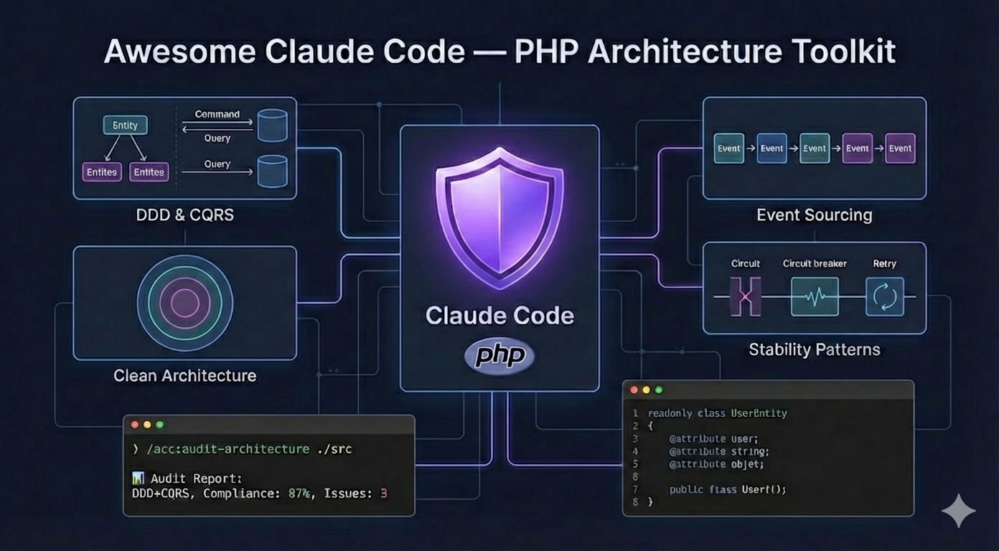

# Awesome Claude Code — PHP Architecture Toolkit

[](https://marketplace.claude.ai/plugin/dykyi-roman/awesome-claude-code)
[](https://php.net)
[](https://claude.ai/code)
[](https://en.wikipedia.org/wiki/Domain-driven_design)
[](https://martinfowler.com/bliki/CQRS.html)
[](https://github.com/dykyi-roman/awesome-claude-code/blob/master/LICENSE)
[](https://github.com/dykyi-roman/awesome-claude-code)
[](https://github.com/dykyi-roman/awesome-claude-code)

> **The most comprehensive Claude Code extension for PHP developers.** Current version: **v3.2.0**
> Audit, Generate & Document: DDD, CQRS, Event Sourcing, Clean/Hexagonal Architecture, Design Patterns, PSR, Tests ...



## Quick Start

```bash
/plugin marketplace add dykyi-roman/awesome-claude-code
/plugin install acc@awesome-claude-code
```

Then in Claude Code:

```bash
/acc:code-review                    # Review current branch
/acc:bug-fix "NullPointerException" # Diagnose and fix bug
/acc:explain GET /api/orders        # Explain HTTP route
/acc:audit-architecture ./src       # Full architecture audit
/acc:generate-documentation         # Write documentation
/acc:generate-test                  # Write test
```

## Demo


## Features

### Code Review (3-Level Analysis)

```bash
/acc:code-review feature/payment high -- implement Stripe payment processing
```

Multi-level automated code review with **9 specialized reviewers**:

| Level | Reviewers | What's Checked |
|-------|-----------|----------------|
| **LOW** | PSR Auditor, Test Auditor | Coding standards, test quality |
| **MEDIUM** | + Bug Hunter, Readability Reviewer | Logic errors, null pointers, naming, complexity |
| **HIGH** | + Security, Performance, Resources, Scalability, Testability, DDD, Architecture | OWASP Top 10, N+1 queries, memory leaks, connection pools, scalability readiness, DDD compliance |


```
# Code Review Report

**Mode:** BRANCH
**Branch:** `feature/payment` → `main`
**Files Reviewed:** 12 (+456/-23 lines)
**Review Level:** HIGH

## Review Findings

### 🔴 Critical (1)
| ID | Category | Location | Issue |
|----|----------|----------|-------|
| CR-001 | Security | PaymentService.php:45 | SQL injection via string concatenation |

### 🟠 Major (3)
| ID | Category | Location | Issue |
|----|----------|----------|-------|
| CR-002 | Bug | Order.php:89 | Null pointer when items empty |
| CR-003 | Performance | CartRepository.php:34 | N+1 query in loop |
| CR-004 | DDD | PaymentService.php:12 | Domain logic in Application layer |

### 🟡 Minor (5)
| ID | Category | Location | Issue |
|----|----------|----------|-------|
| CR-005 | Style | UserService.php:23 | Method exceeds 30 lines |
| ... | ... | ... | ... |

## Task Match Analysis
**Expected Task:** implement Stripe payment processing
**Match Score:** 85%

## Verdict
❌ **REQUEST CHANGES** — 1 critical, 3 major issues found

**Required Actions:**
1. Fix SQL injection in PaymentService.php:45
2. Add null check in Order.php:89
3. Move domain logic from Application to Domain layer
```

### Bug Fix System

Automated bug diagnosis, fix generation, and regression testing:

```bash
/acc:bug-fix "NullPointerException in OrderService::process()"
/acc:bug-fix src/Domain/Order.php:45 "off-by-one error"
/acc:bug-fix @storage/logs/error.log -- focus on validation
```

| Phase | Agent | What It Does |
|-------|-------|--------------|
| **Diagnose** | bug-hunter | Categorizes bug (9 types), finds root cause |
| **Fix** | bug-fixer | Generates minimal, safe fix with 11 skills |
| **Test** | test-generator | Creates regression test |
| **Verify** | coordinator | Applies fix, runs tests, reports results |

**Bug Categories:** logic errors, null pointers, boundary issues, race conditions, resource leaks, exception handling, type issues, SQL injection, infinite loops

### Architecture Audit Engine

Comprehensive analysis across **10+ architecture patterns**:

- **Structural**: DDD, Clean Architecture, Hexagonal, Layered, SOLID, GRASP
- **Behavioral**: CQRS, Event Sourcing, Event-Driven Architecture, Strategy, State
- **Integration**: Saga, Outbox, Anti-Corruption Layer
- **Stability**: Circuit Breaker, Retry, Rate Limiter, Bulkhead

### Code Generation

**50+ generators** for DDD/CQRS components with tests:

- DDD: Entity, ValueObject, Aggregate, Repository, DomainEvent, DomainService, Specification, Factory
- CQRS: Command, Query, Handler, UseCase, ReadModel
- Patterns: Strategy, State, Decorator, Builder, ObjectPool, CircuitBreaker, Saga, Outbox
- PSR: Logger (PSR-3), Cache (PSR-6/16), HTTP (PSR-7/15/17/18), Container (PSR-11), Clock (PSR-20)

### Claude Component Generation

```bash
/acc:generate-claude-component
> What would you like to create? command
> Command name? validate-order
> What should it do? Validate Order aggregate invariants
> Should it use agents? Yes, ddd-auditor
```

Generates:
- `commands/validate-order.md` — Custom slash command

### Knowledge Bases

**53 knowledge skills** covering:

- Architecture: DDD, CQRS, Clean, Hexagonal, Layered, Event Sourcing, EDA, Microservices
- Principles: SOLID, GRASP, PSR-1/4/12
- Patterns: Saga, Outbox, Stability, ADR
- System Design: Consistency, Observability, Access Control, Scalability, Replication, 12-Factor
- API & Messaging: REST design, Message Queues, Caching Strategies
- Frameworks: Symfony, Laravel, Yii, CodeIgniter, No-Framework
- Documentation: Mermaid, C4 Model, ADR templates
- Docker: 12 Docker knowledge skills (core, multistage, security, production, etc.)

### Developer Safeguards

**21 hooks** protecting code quality in real-time:

- DDD guards: readonly classes, immutable Value Objects, aggregate protection
- Security: no debug output, no hardcoded paths, no global state
- Quality: strict_types required, PSR-12 formatting, syntax validation

## Component Flow

```
COMMAND ───────→ COORDINATOR ───────→ AGENTS ───────→ KNOWLEDGE SKILLS ──────→ GENERATORS SKILLS

/acc:code-review ──→ code-review-coordinator
                            │
                            ├─ LOW ──────→ psr-auditor ─────────→ psr-knowledge ─────────→ create-psr-*
                            │              test-auditor ────────→ testing-knowledge ────→ create-test-*
                            │
                            ├─ MEDIUM ───→ bug-hunter ──────────→ bug-fix-knowledge ────→ generate-bug-fix
                            │              readability-reviewer → code-smells-analyzer
                            │
                            └─ HIGH ─────→ security-reviewer ───→ owasp-skills ─────────→ create-validator
                                           performance-reviewer → optimization-skills
                                           ddd-auditor ─────────→ ddd-knowledge ────────→ create-entity,
                                           │                                               create-value-object,
                                           │                                               create-aggregate...
                                           architecture-auditor → arch-knowledge ───────→ create-*, pattern-*

/acc:audit-architecture ──→ architecture-auditor (coordinator)
                                    │
                                    ├──→ structural-auditor ────→ ddd-knowledge ────────→ create-entity
                                    │                             clean-arch-knowledge    create-value-object
                                    │                             hexagonal-knowledge     create-repository
                                    │                             microservices-knowledge create-use-case
                                    │
                                    ├──→ principles-auditor ────→ solid-knowledge ──────→ analyze-solid-violations
                                    │                             grasp-knowledge         detect-code-smells
                                    │
                                    ├──→ behavioral-auditor ────→ cqrs-knowledge ───────→ create-command
                                    │                             event-sourcing-knowledge create-query
                                    │                             eda-knowledge           create-saga
                                    │
                                    ├──→ integration-auditor ───→ saga-knowledge ───────→ create-outbox
                                    │                             outbox-knowledge        create-circuit-breaker
                                    │                             stability-knowledge     create-retry
                                    │
                                    └──→ pattern-generator ─────→ (coordinates generators)
                                              ├──→ stability-generator ──→ circuit-breaker, retry, rate-limiter
                                              ├──→ behavioral-generator ─→ strategy, state, decorator, visitor, memento
                                              ├──→ gof-structural-generator → adapter, facade, proxy, composite
                                              ├──→ creational-generator ─→ builder, factory, object-pool
                                              ├──→ messaging-generator ───→ saga, outbox, correlation, broker
                                              └──→ api-infrastructure-generator → ADR, versioning, health

/acc:bug-fix ─────────────→ bug-fix-coordinator
                                    │
                                    ├──→ bug-hunter ────────────→ detection-skills ─────→ (9 analyzers)
                                    ├──→ bug-fixer ─────────────→ fix-knowledge ────────→ generate-bug-fix
                                    └──→ test-generator ────────→ testing-knowledge ────→ create-unit-test
                                                                                           create-regression-test

/acc:generate-test ──────────→ test-generator ─────────────→ testing-knowledge ────→ create-unit-test
                                                                                   create-integration-test
                                                                                   create-mock-repository

/acc:generate-documentation ─→ documentation-writer ───────→ doc-knowledge ────────→ readme-template
                                    │                                               architecture-template
                                    └──→ diagram-designer ──────→ diagram-knowledge ───→ mermaid-template
                                                                                          c4-template

/acc:audit-docker ────────→ docker-coordinator
                                    │
                                    ├──→ docker-architect ────────→ multistage-knowledge ──→ create-dockerfile
                                    ├──→ docker-security ─────────→ security-knowledge ───→ check-security
                                    ├──→ docker-performance ──────→ buildkit-knowledge ───→ optimize-build
                                    ├──→ docker-compose ──────────→ compose-knowledge ────→ check-compose
                                    ├──→ docker-production ───────→ production-knowledge ─→ check-readiness
                                    └──→ docker-debugger ─────────→ troubleshoot-knowledge

/acc:generate-docker ────→ docker-coordinator
                                    │
                                    ├──→ docker-architect ────────→ create-dockerfile-production
                                    ├──→ docker-compose ──────────→ create-compose-dev, create-compose-prod
                                    ├──→ docker-image-builder ───→ create-php-config, create-entrypoint
                                    └──→ docker-production ──────→ create-nginx, create-healthcheck

/acc:ci-fix ──────────────→ ci-coordinator
                                    │
                                    ├──→ ci-debugger ───────────→ analyze-ci-logs, ci-pipeline-knowledge
                                    └──→ ci-fixer ──────────────→ generate-ci-fix, ci-tools-knowledge
```

See [Component Flow](docs/component-flow.md) for the complete dependency graph.

## Why Use This?

| Without | With Awesome Claude Code |
|---------|--------------------------|
| Manual boilerplate code | One command generates complete component with tests |
| Architecture drift over time | Automated compliance audits catch violations early |
| Inconsistent patterns across team | Standardized DDD/CQRS templates ensure consistency |
| Hours reviewing PRs manually | 3-level automated review catches bugs, security issues |
| Learning DDD/CQRS from scratch | Built-in knowledge bases explain patterns in context |

## Documentation

| Document                                   | Description                                   |
|--------------------------------------------|-----------------------------------------------|
| [Commands](docs/commands.md)               | 26 slash commands with examples               |
| [Agents](docs/agents.md)                   | 68 specialized subagents                      |
| [Skills](docs/skills.md)                   | 283 skills (knowledge, generators, analyzers) |
| [Hooks](docs/hooks.md)                     | 21 PHP/DDD hooks                              |
| [Component Flow](docs/component-flow.md)   | Architecture and dependency graph             |
| [MCP](docs/mcp.md)                         | MCP server configuration                      |
| [Quick Reference](docs/quick-reference.md) | Paths, formats, best practices                |

## Use Cases

| Scenario               | Command                              | Result                                       |
|------------------------|--------------------------------------|----------------------------------------------|
| Fix a bug              | `/acc:bug-fix "NullPointerException"` | Diagnosis + fix + regression test            |
| Review PR before merge | `/acc:code-review feature/auth high`  | Security, performance, DDD compliance report |
| Audit legacy codebase  | `/acc:audit-architecture ./src`       | Pattern detection + compliance score         |
| Security audit         | `/acc:audit-security ./src`           | OWASP Top 10 + PHP-specific vulnerabilities  |
| Performance audit      | `/acc:audit-performance ./src`        | N+1 queries, memory issues, caching gaps     |
| Design patterns audit  | `/acc:audit-patterns ./src`           | Stability, behavioral, creational patterns   |
| Generate PSR component | `/acc:generate-psr psr-15 Auth`       | PSR-compliant implementation with tests      |
| Generate design pattern| `/acc:generate-patterns strategy Pay` | Pattern implementation with DI configuration |
| Explain code           | `/acc:explain src/Domain/Order/`      | Structure, business logic, data flows        |
| Onboard to project     | `/acc:explain .`                      | Project guide with glossary and diagrams     |
| Audit Docker config    | `/acc:audit-docker ./`                | Dockerfile, Compose, security, performance   |
| Generate Docker stack  | `/acc:generate-docker full`           | Dockerfile + Compose + Nginx + entrypoint    |
| Refactor code          | `/acc:refactor ./src/OrderService`    | Analysis + prioritized roadmap + generators  |
| Create Claude command  | `/acc:generate-claude-component`      | Create command, agent, skills                |
| Audit test quality     | `/acc:audit-test ./tests`             | Coverage gaps, test smells, recommendations  |
| Generate documentation | `/acc:generate-documentation ./src`   | README + ARCHITECTURE.md + diagrams          |

## Supported Patterns

**Architecture:**
- Domain-Driven Design (DDD) — Aggregates, Entities, Value Objects, Domain Events, Repositories
- CQRS — Command/Query separation, Handlers, Buses
- Clean Architecture — Use Cases, Boundaries, Dependency Inversion
- Hexagonal Architecture — Ports & Adapters, Primary/Secondary adapters
- Event Sourcing — Event stores, Projections, Snapshots
- Event-Driven Architecture — Messaging, Pub/Sub, Event handlers

**Integration:**
- Saga Pattern — Orchestration, Choreography, Compensation
- Outbox Pattern — Transactional messaging, Reliable delivery
- Anti-Corruption Layer — External system isolation, Translation

**Stability:**
- Circuit Breaker, Retry, Rate Limiter, Bulkhead

**System Design:**
- Idempotency Handler, Structured Logger, Access Control (RBAC/ABAC)
- Distributed Lock, Read-Write Proxy, Metrics Collector

**Standards:**
- PSR-3, 6, 7, 11, 13, 14, 15, 16, 17, 18, 20 implementations

## Requirements

- **PHP 8.4+** — for generated code (strict typing, readonly classes)
- **Claude Code CLI** — [Installation guide](https://docs.anthropic.com/en/docs/claude-code)

## Installation (v2.x — Composer)

> **Note:** v2.x is no longer maintained. Use the [marketplace version](#quick-start) (v3.0.0+) for the latest features and automatic updates.

If you need to use the legacy Composer-based version (v2.14.0):

```bash
composer require --dev dykyi-roman/awesome-claude-code:^2.14
```

After installation, register the Composer plugin:

```bash
./vendor/bin/acc install
```

This copies commands, agents, and skills into your `.claude/` directory. Commands use dash syntax: `/acc-audit-architecture`, `/acc-code-review`, etc.

### v2.x Requirements

- PHP 8.4+
- Composer 2.0+
- Claude Code CLI

### v2.x Updates

```bash
composer update dykyi-roman/awesome-claude-code
./vendor/bin/acc upgrade
```

## Migration from v2.x to v3.0.0

v3.0.0 is a **breaking change** — the plugin moved from Composer to the Claude Code Marketplace. Follow these steps to upgrade:

### Step 1: Remove the Composer package

```bash
composer remove dykyi-roman/awesome-claude-code
```

### Step 2: Clean up old components

Remove all v2.x files that were copied to `.claude/`:

```bash
rm -rf .claude/commands/acc-* .claude/agents/acc-* .claude/skills/acc-*
```

> **Warning:** If you customized any `acc-*` files, back them up first. Your `.claude/settings.json` and `.claude/rules/` are not affected.

### Step 3: Install from the marketplace

```bash
/plugin marketplace add dykyi-roman/awesome-claude-code
/plugin install acc@awesome-claude-code
```

### Step 4: Update command references

All commands changed from dash (`-`) to colon (`:`) syntax:

```bash
# Before (v2.x)
/acc-code-review feature/auth high
/acc-audit-architecture ./src
/acc-generate-ddd entity Order

# After (v3.0.0)
/acc:code-review feature/auth high
/acc:audit-architecture ./src
/acc:generate-ddd entity Order
```

If you have scripts or documentation referencing old command names, update them.

### What changed

| Aspect | v2.x (Composer plugin) | v3.0.0 (Marketplace plugin) |
|--------|------------------------|-----------------------------|
| **Install method** | `composer require` | `/plugin marketplace add` + `/plugin install` |
| **Command syntax** | `/acc-command` (dash) | `/acc:command` (colon) |
| **Component paths** | `.claude/commands/acc-*.md` | `commands/*.md` (managed by plugin system) |
| **PHP/Composer dependency** | Required Composer 2.0+ | No PHP/Composer dependency for the plugin itself |
| **Updates** | `composer update` + `./vendor/bin/acc upgrade` | Automatic via marketplace |
| **Component location** | Copied to `.claude/` by Composer plugin | Managed by Claude Code plugin system |
| **Customization** | Edit files in `.claude/` directly | Fork the plugin or override locally |

## FAQ

<details>
<summary><strong>How does installation work?</strong></summary>

The marketplace plugin is managed by Claude Code's native plugin system. When you run `/plugin install acc@awesome-claude-code`, Claude Code registers the plugin's commands, agents, and skills. Updates are delivered automatically through the marketplace -- no manual steps required.
</details>

<details>
<summary><strong>Can I customize generated code?</strong></summary>

Yes! Skills use templates stored in the `references/` folder within each skill directory. You can modify these templates to match your project's coding style, naming conventions, or add custom functionality.
</details>

<details>
<summary><strong>Which PHP versions are supported?</strong></summary>

Generated code targets PHP 8.4+ and uses modern features like readonly classes, constructor property promotion, and strict typing. The skills themselves work with Claude Code on any platform.
</details>

<details>
<summary><strong>How do I add my own commands/skills?</strong></summary>

Use the `/acc:generate-claude-component` wizard to create new components interactively. It guides you through creating commands, agents, or skills with proper formatting and structure.
</details>

<details>
<summary><strong>What if I want to update to a newer version?</strong></summary>

Marketplace plugins update automatically. When a new version is published, Claude Code picks up the latest components on next use. No manual upgrade steps are needed.
</details>

<details>
<summary><strong>Can I use only specific skills?</strong></summary>

Yes. After installation, you can remove unwanted components. Each component (command, agent, skill) works independently.
</details>

## Troubleshooting

<details>
<summary><strong>Skill not loading</strong></summary>

**Symptom:** Agent doesn't use expected skill.

**Solutions:**
1. Check `skills:` list in agent frontmatter (`agents/agent-name.md`)
2. Verify skill exists in `skills/skill-name/SKILL.md`
3. Check skill name matches exactly (case-sensitive, with hyphens)

```yaml
# In agent file:
---
skills:
  - ddd-knowledge  # Must match skill folder name
---
```
</details>

<details>
<summary><strong>Agent not invoked by command</strong></summary>

**Symptom:** Command runs but doesn't use the expected agent.

**Solutions:**
1. Verify command uses `Task` tool with correct `subagent_type`
2. Check agent file exists in `agents/`
3. Ensure agent name in command matches agent filename (without `.md`)

```markdown
# In command file:
Use the Task tool with subagent_type="acc:ddd-auditor"
```
</details>

<details>
<summary><strong>Hooks not triggering</strong></summary>

**Symptom:** Code changes don't trigger validation hooks.

**Solutions:**
1. Verify `.claude/settings.json` exists and is valid JSON
2. Check hook patterns match your file paths
3. Ensure Claude Code has permission to execute hooks
4. Run `make validate-claude` to check configuration
</details>

<details>
<summary><strong>Generated code has wrong namespace</strong></summary>

**Symptom:** Generated classes have incorrect PSR-4 namespace.

**Solutions:**
1. Check your `composer.json` autoload configuration
2. Specify target path when generating: `/acc:generate-claude-component` prompts for location
3. Edit generated files to match your project structure
</details>

## Contributing

Contributions are welcome! Please see [CONTRIBUTING.md](CONTRIBUTING.md) for guidelines.

## License

The MIT License (MIT). Please see [License File](LICENSE) for more information.
